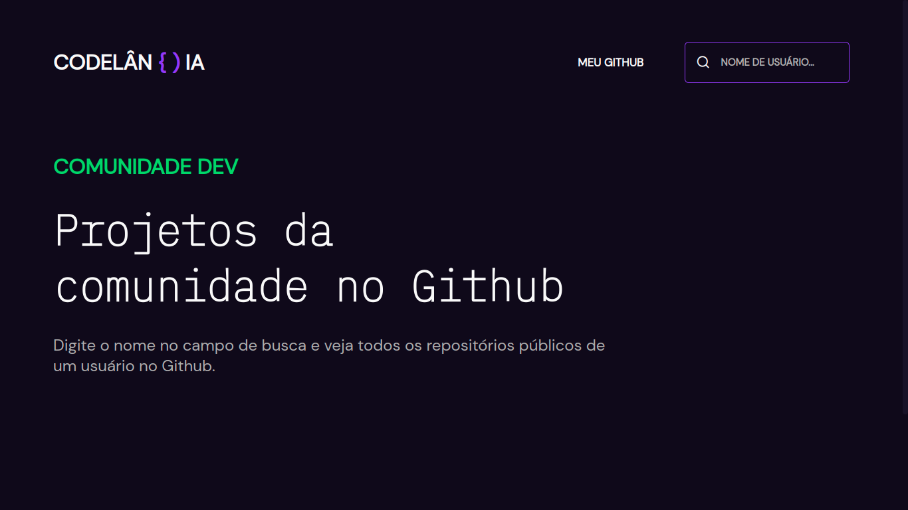

  
  

  
### 🚀 Technologies
- Vite
- HTML5
- SCSS
- TypeScript
- Scrollreveal
- Remixicons
- [Github API](https://docs.github.com/pt/rest)
- [Google Fonts](https://fonts.google.com/)

### 💻 Project
The project uses the Github API and Typescript object-oriented programming to generate cards with repositories of users typed into the search field.

Here is the deploy [link](https://desafio22-codelandia.vercel.app/).

### 🔖 Layout
Here is the design [link](https://www.figma.com/file/Yb9IBH56g7T1hdIyZ3BMNO/Desafios---Codel%C3%A2ndia?node-id=91586%3A803) for that project.

### 📝 License
This project is under the MIT license. See the [file](LICENSE) for more details.
